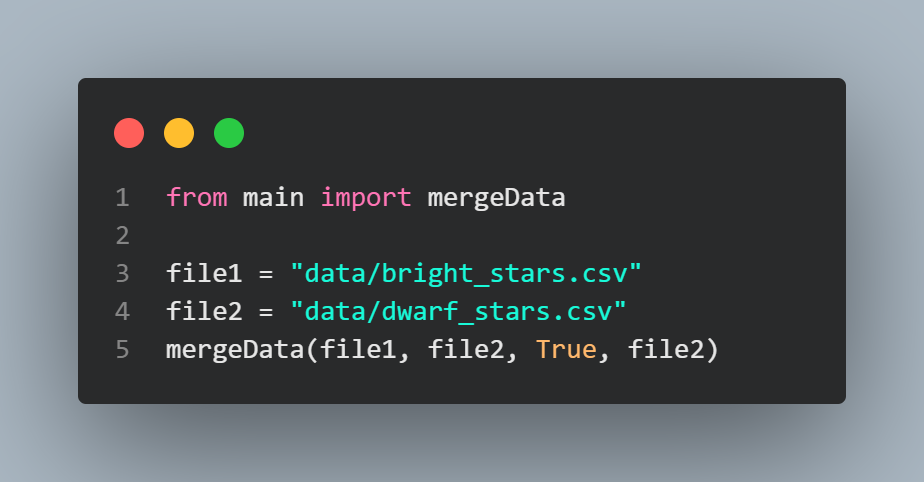
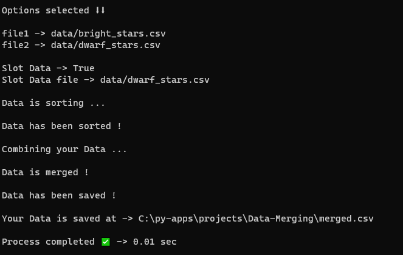
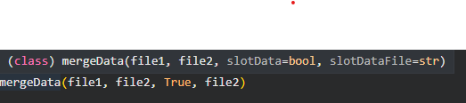

# Data Merging

Data Merging or CSV Merger , it can merge double csv files into one , it can hold upto 3.5GB of csv file into one csv file.You can you this in your project. made by [Junaid](https://abujuni.dev) .

- [About Data Merging](#about-data-merging)
- [How can I use in my project](#how-can-i-use-in-my-project)
- [Props of Data Merging](#props-of-data-merging)
- [Examples](#examples)

## About Data Merging

Data Merging or CSV Merger , it can merge double csv files into one , it can hold upto 3.5GB of csv file into one csv file. made by [Junaid](https://abujuni.dev) .

```console
 4KB -> 1.csv -> | Data Merging.py | -> merged.csv
 12KB ->  2.csv ----------⬆
```

output :

```console
calculation - > 12 + 4 = 16KB

Real -> merged.csv -> 6KB
```

It removes unused space , that spaces when made by csv program which is under the using of csv module.
like - `csv` - Python inbuilt `csv` - module , which used old methods to make csv file .
I used `Pandas` - module , which is used in data analyzing and data processing , it uses latest methods to process or create csv.
for less storage , I used the potable `pandas` - module to get low space in your computer.

**Meaning of Potable Pandas**

_Potable Pandas_ -> _Which acts like python `pandas` - module and works like python `pandas` - module , but the code is different ._[ FreeCodingCamp ]

**Potable Pandas** -> _Which is a function or class used in python script , but not as module ._[ Wikipedia ]

## How can I use in my project

By simple code.

Output :


```python
from main import mergeData

file1 = "data/bright_stars.csv"
file2 = "data/dwarf_stars.csv"
mergeData(file1, file2)
```

Output:

```console
file1.csv and file2.csv -> merged.csv (only csv)
```

**It have csv slotting** -

```console
"AAAABBBB" -> a.csv
"aaaabbbsss" -> b.csv

--- after slotting ---

slotted.csv -> capital,small
                A,      a,
                A,      a,
                A,      a,
                A,      a,
                B,      b,
                ..      ..
```

By add `True` - in `mergeData(file1, file2, True, file2)` to slot the data.
(or) usually use `mergeData(file1, file2)` , to merge the two csv files.

## Props of Data Merging

Data Merging is not module in pip but you can use it as local computer module .

- compatible with all computer like : windows 10 , 11 , macOS and linux , (also supported for cloud based computers) .



```python
mergeData(file1, file2, slotData=bool,slotDataFile=str)
```

- file1 - Enter a csv file path.
- file2 - Enter second csv file path to combine.
- slotData - This is a `bool()` type , when you type `True` , it will slot data and combine it.
- slotDataFile - This is a `str()` type , which checks whether your file is exist or not.

- `slotData=bool` and `slotDataFile=str` are optional to slot and combine or not slot only combine.

## Examples

- Using Both methods
  

```python
from main import mergeData

file1 = "data/bright_stars.csv"
file2 = "data/dwarf_stars.csv"
mergeData(file1, file2, True, file2)

```

- Only slotting

```python
from main import mergeData

file = "example.csv"
a = mergeData.slotData(file)

print(a)

```

- Only merging

```python
from main import mergeData

file1 = "example.csv"
file2 = "example2.csv"
mergeData(file1, file2)

```

**Made By [Junaid](https://abujuni.dev) .**
